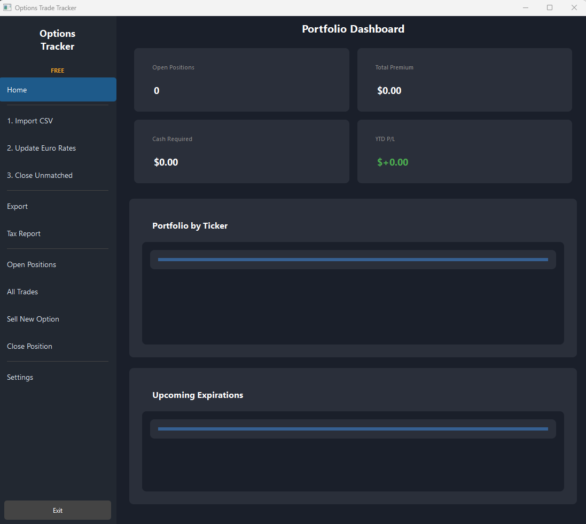

# Options Tax Tracker (Germany)

A desktop tool for German taxpayers who sell (write) stock options through Interactive Brokers or CapTrader. It calculates the tax corrections needed because **German tax law treats short options differently than US/IBKR reporting**.

## The Problem

Under German tax law (*Zuflussprinzip* / *Vereinnahmung der Stillhalterpr&auml;mie*), the premium from selling an option is taxable **when the position is opened**, not when it is closed. Interactive Brokers reports realized gains only when positions are closed, which does not match the German tax treatment.

This creates two discrepancies each tax year:

| Scenario | IBKR reports | German tax requires |
|---|---|---|
| Option sold in 2025, still open on Dec 31 | Nothing (not yet realized) | Taxable in 2025 |
| Option sold in 2024, closed in 2025 | Realized gain/loss in 2025 | Already taxed in 2024, correction needed |

This tool calculates both corrections so you can adjust the IBKR Activity Statement for your German tax return (*Anlage KAP*).

## Download

[**Download options_tracker.exe**](https://github.com/edwinerpenbach-hub/options-tax-germany/releases/latest/download/options_tracker.exe) (Windows, no installation required)

## Features

- **Tax Report Generator** -- Calculates Step 1 (add) and Step 2 (subtract) corrections per tax year, with EUR conversion
- **Portfolio Dashboard** -- Overview of open positions, premium, P/L, and upcoming expirations
- **Trade Management** -- Sell new options, close positions (FIFO), view all trades
- **Import/Export** -- Import trades from CSV (IBKR Activity Statement), export to CSV/Excel
- **ECB Exchange Rates** -- Download EUR/USD rates from the ECB and auto-fill missing rates
- **Dark-themed PyQt6 GUI** -- Modern desktop interface, standalone `.exe` -- no Python installation required

## Screenshot

